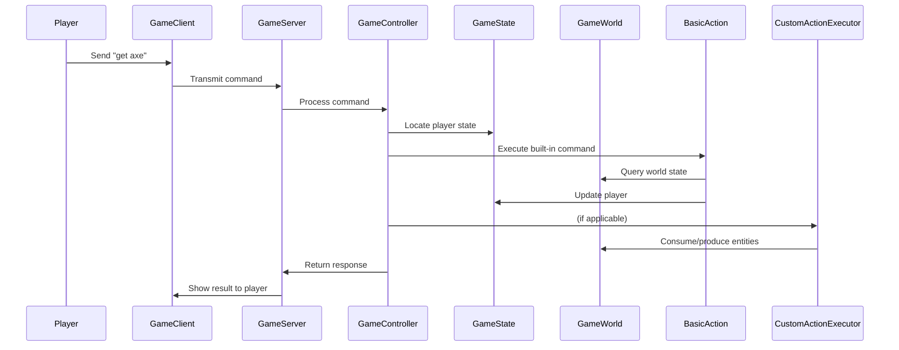

# 🕹️ STAG - Simple Text Adventure Game

A multiplayer socket-based text adventure engine built in Java.  
Supports both **basic** and **custom** actions defined via external configuration files (`.dot`, `.xml`). Players can explore, interact, and affect the world through textual commands like `look`, `get`, or even `chop tree with axe`.

---

## 📁 Project Structure

```bash
cw-stag/
├── config/
│   ├── basic-entities.dot      # Entity and location definitions
│   └── basic-actions.xml       # Custom actions and triggers
├── src/main/java/edu/uob/
│   ├── GameServer.java         # 🔌 Main socket server
│   ├── GameClient.java         # 🧪 CLI testing client
│   ├── actions/                # 🎮 Game Actions
│   │   ├── GameAction.java
│   │   ├── BasicAction.java    # Built-in commands: look, get, drop, etc.
│   │   ├── CustomAction.java   # XML-defined actions
│   │   └── CustomActionExecutor.java

│   ├── entities/               # 🧱 Game Entities
│   │   ├── GameEntity.java
│   │   ├── Artefact.java
│   │   ├── Furniture.java
│   │   ├── GameCharacter.java
│   │   ├── Location.java
│   │   └── PlayerState.java

│   ├── parsers/                # 📄 Parsers for config files
│   │   ├── EntityParser.java   # Parses .dot
│   │   └── ActionParser.java   # Parses .xml

│   └── games/                  # 🧠 Game Logic
│       ├── GameWorld.java
│       ├── GameState.java
│       └── GameController.java
```

---

## ⚙️ How It Works

### Command Lifecycle (Client → Server → Result)



---

## 🛠️ How to Run

```bash
# Build and start the server
mvn clean compile exec:java@stag

# In another terminal, start the client
java -cp target/classes edu.uob.GameClient yourname
```

---

## 🧪 Sample Commands

```bash
look
inv
get axe
goto forest
chop tree with axe
bridge river with log
dig ground with shovel
health
hit elf
```

---

## 🧩 Custom Actions (XML)

Defined in `basic-actions.xml` using:

- `<triggers>` — phrases like `"chop"`
- `<subjects>` — required items
- `<consumed>` — things used up
- `<produced>` — new entities created
- `<narration>` — shown to the player

```xml
<action>
  <triggers>
    <keyword>chop</keyword>
  </triggers>
  <subjects>
    <entity>axe</entity>
    <entity>tree</entity>
  </subjects>
  <consumed>
    <entity>tree</entity>
  </consumed>
  <produced>
    <entity>log</entity>
  </produced>
  <narration>You chopped the tree and got a log!</narration>
</action>
```

---

## ✅ Features

- [x] Basic commands: `look`, `get`, `drop`, `goto`, `inv`
- [x] Multiplayer support with isolated state
- [x] Config-driven world parsing from `.dot` and `.xml`
- [x] Fully dynamic custom actions
- [x] Health system with `fight`, `drink`, `health`, and respawn logic

---

## 📌 Author

Created by **Negi Chen**  
University of Bristol – COMS Coursework  
Spring 2025
